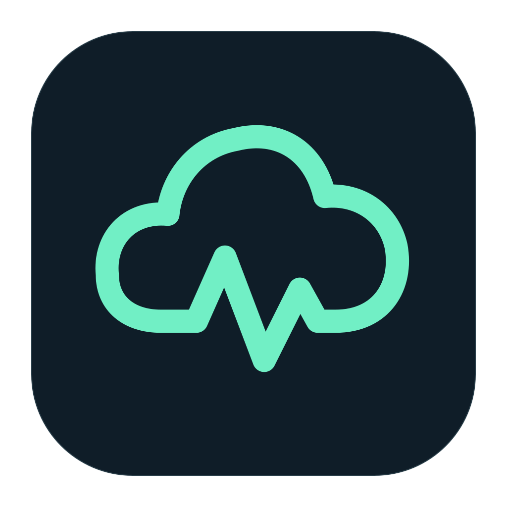
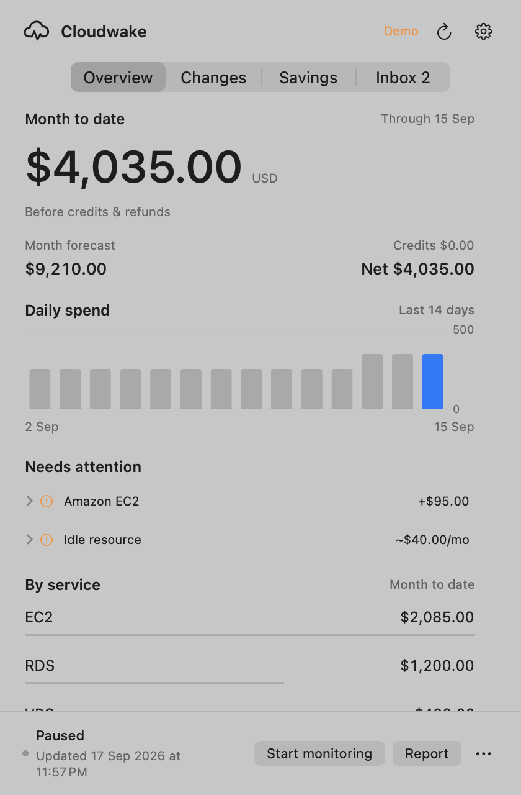
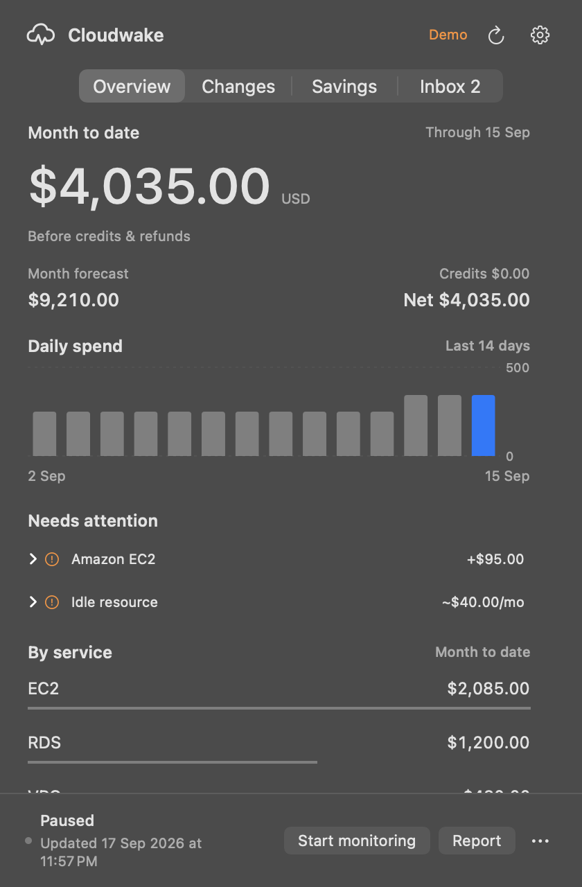
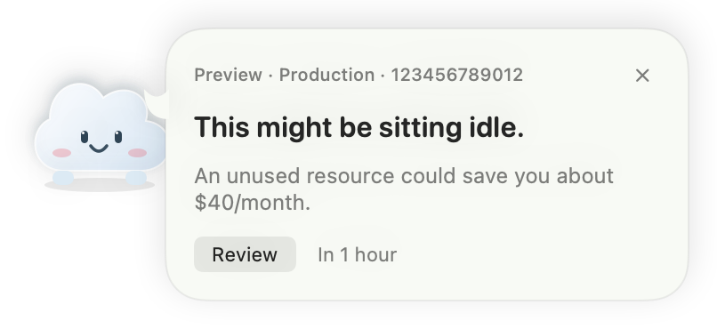
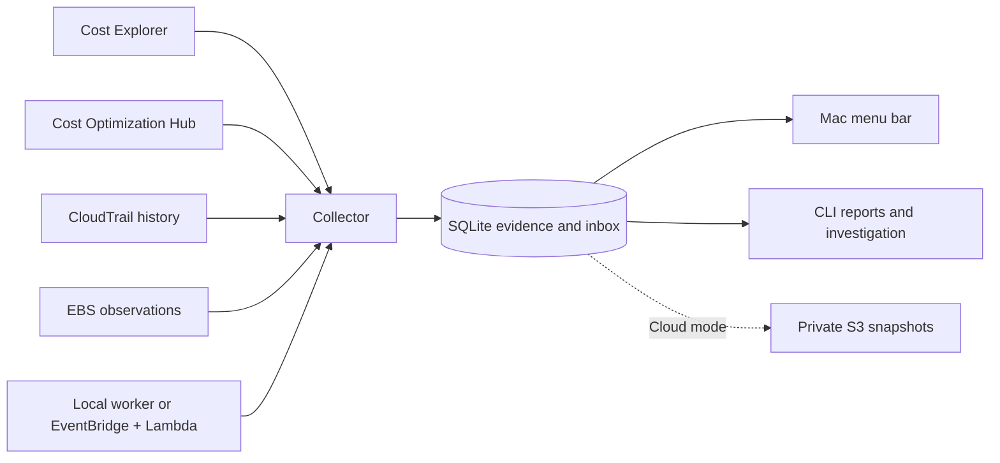

<p align="center">
  
</p>
<h1 align="center">Cloudwake</h1>
<p align="center"><strong>Version 1.2.1 · Private source</strong></p>
<p align="center"><strong>Know what your AWS is costing. Catch what it leaves running.</strong></p>
<p align="center">A native Mac menu bar app for AWS spending, resource activity, and savings—with optional monitoring that stays awake in AWS.</p>
<p align="center">
  <a href="https://github.com/pratik-mahalle/infralive/actions/workflows/check.yml"></a>
  
  
  
</p>
<p align="center">
  <a href="#try-cloudwake">Quick start</a> ·
  <a href="#connect-your-aws-account">Connect AWS</a> ·
  <a href="docs/always-on.md">Always-on setup</a> ·
  <a href="docs/reference.md">Full reference</a>
</p>

<p align="center">
  
  
</p>
<p align="center"><sub>Native SwiftUI. Light and dark appearances. Screenshots use synthetic demo data.</sub></p>

## A clearer view of your cloud

Cloudwake puts the answers a CTO needs one click away: where money is going, what changed,
who created a resource, and what deserves a closer look. Your infrastructure stays under your
control; Cloudwake does not stop, resize, or delete monitored resources.

| View | What you get |
| --- | --- |
| **Accounts** | Monitor multiple accounts at once. Switch views without stopping other accounts; keep each bill and inbox separate. |
| **Overview** | Month-to-date charges, credits and net balance, a monthly forecast, daily spending, and cost increase alerts. |
| **Changes** | Resource creation, update, and deletion activity from CloudTrail, with the AWS identity behind each event. |
| **Savings** | AWS recommendations with estimated savings, investigation priorities, and repeated unused-resource observations. |
| **Inbox** | Persistent alerts you can review, reopen, and snooze. A cloud companion while using the app; native Mac banners in the background. |
| **Always-on monitoring** | A private collector in your AWS account that keeps checking while your Mac sleeps or the app is closed. |

**v1.1 scope:** multiple AWS accounts with independent connections and an account switcher, AWS only. The Python collector can run locally or in
AWS; the desktop app requires macOS. GCP, Azure, organization-wide reporting, and weekly email
are not implemented. The optional local SES integration supports daily reports and alerts;
the always-on deployment keeps email disabled.

<p align="center"></p>

## Download for Mac

For **Apple silicon · macOS 13+**:

```sh
brew tap pratik-mahalle/tap
brew install --cask pratik-mahalle/tap/cloudwake
```

Or [download Cloudwake](https://github.com/pratik-mahalle/cloudwake-releases/releases/latest).
The app includes Python and the AWS SDK. This build is not Apple-notarized;
see the [installation notes](docs/downloads.md) for first launch and AWS profile setup.
Intel Macs can build from source below.

## Try Cloudwake

You need **Python 3.11+**. Building the Mac app also needs **macOS 13+** and Xcode Command Line
Tools (`xcode-select --install`). There are no third-party Swift dependencies.

```sh
git clone https://github.com/pratik-mahalle/infralive.git
cd infralive
python3 -m venv .venv
source .venv/bin/activate
pip install -r requirements.lock -e .

# Explore with synthetic data. No AWS account or network calls required.
aws-cost-agent demo

# Build and open the menu bar app.
bash macos/build.sh
open dist/Cloudwake.app
```

On first launch, Cloudwake opens AWS account setup directly. Choose an AWS profile or paste
credentials to connect; the menu bar shows your spending after collection. The local build uses this checkout's Python environment, so keep the project
and `.venv` available. Standalone downloads bundle their own runtime; the local development build uses your checkout.

Prefer a terminal? The CLI works without the Mac app:

```sh
aws-cost-agent --demo report
aws-cost-agent --demo ask "Where can we reduce spending?"
aws-cost-agent --demo inbox list --filter open
```

The Python package and CLI retain the name `aws-cost-agent` for compatibility.

## Connect your AWS account

1. Open Cloudwake's **Settings**. Choose **AWS profile** for an existing CLI profile
   (SSO, access keys, and credential-process profiles are supported), or **Paste credentials**.
2. For pasted credentials, copy AWS `export` lines, credential JSON, or a credentials-file
   section, then click **Paste from clipboard**. You can also enter an access key ID and
   secret access key directly. Temporary credentials require the session token too.
   Choose the resource region. AWS CLI and SSO are not required for this option.
3. Select **Check account**, then **Connect this account**.
4. Repeat **Add or reconnect an account** for each AWS account. Give connections names such as
   Production and Staging. New accounts start local monitoring automatically. The account picker
   switches views while other accounts keep monitoring; **Your accounts** has individual pause,
   rename and remove controls. Existing connections migrate automatically on upgrade.
5. Enable Mac notifications if you want banners. Use **Savings → Enable AWS savings…** to
   enroll the account in standard AWS recommendation analysis when needed.

The connection check verifies the account and available access. Existing profiles use the AWS
SDK credential chain. Imported credentials are verified with STS and saved in **macOS Keychain**;
only account identifiers are written to local settings. Clipboard access happens only when you
click Paste, and pasted shell text is never executed. Cloudwake cannot read exported variables
from an already-open terminal automatically.

Temporary credentials must be replaced when they expire. Open **Paste credentials**, paste a
fresh set, check the account, and connect again. For the same account and region, this reuses
the saved connection and history. Static access keys can be replaced the same way when rotated.
Use an IAM identity with the permissions described below; do not use root access keys.
Connecting does not deploy cloud infrastructure. Read calls, including Cost Explorer queries,
can incur AWS charges. Keychain access requires an unlocked login Keychain; Linux/headless
installations continue to use the normal AWS SDK credential chain.

For manual configuration, copy [config.example.toml](config.example.toml) to `config.toml`,
set the account and profile, then run:

```sh
aws-cost-agent --config config.toml sync
aws-cost-agent --config config.toml history
aws-cost-agent --config config.toml run
```

See the [connection and IAM reference](docs/reference.md#connect-an-aws-account) for permissions,
cross-account roles, and optional event queues. Billing covers the connected account across
regions; resource activity covers the configured history regions.

### Keep monitoring while your Mac sleeps

The optional [always-on deployment](docs/always-on.md) runs inside your AWS account:

- CloudTrail activity checks every **5 minutes** and cost collection every **6 hours** by default.
- Lambda execution, private encrypted S3 state, and a DynamoDB lease to serialize state writes.
- A shared inbox, failure logs, a dead-letter queue, and CloudWatch alarms.
- IAM-authenticated access; no public API endpoint or static application token.

The deployment guide covers provisioning, verified handoff from the local worker, and recovery.
AWS service and API usage are metered. Mac banners require an awake Mac and a running app;
alerts collected while you are away remain in the inbox.

## How it works



The app reads saved evidence. An optional Bedrock investigator can answer questions using
read-only evidence tools; without it, `ask` routes questions to saved reports. No LLM is required
for cost collection, resource monitoring, or alerts.

## Understand the numbers

- **Spend is before credits and refunds.** A $120 charge offset by $120 of credits appears as
  $120 spend and $0 net. Other applicable discounts remain part of AWS `UnblendedCost`.
- **Billing is delayed.** The reporting period runs from the start of the UTC month through
  yesterday. AWS can revise estimates; this is not a live meter or a final invoice.
- **Savings are estimates.** Recommendations depend on AWS enrollment and supported resources.
  Investigation priorities are not claimed savings.
- **Unused means observed unused.** Duration tracking covers unattached EBS volumes and eligible
  AWS Stop/Delete recommendations. Resource age alone is not evidence of inactivity.
- **Identities are AWS principals.** A deployment role is shown as a role, not guessed to be a
  teammate. CloudTrail coverage is regional and does not guarantee every resource change.

See the [operation reference](docs/reference.md) for exact thresholds, event coverage, retry
behavior, notification delivery, and known limitations.

## Development

```sh
source .venv/bin/activate
ruff check src scripts tests
ruff format --check src scripts tests
pytest -q
bash macos/test.sh
bash macos/build.sh
```

Python tests use fixtures and stubs; the Swift tests use synthetic fixtures. The
[Codemagic workflow](codemagic.yaml) runs Python 3.12 lint/tests, the offline demo,
Swift tests, and the Mac build on an M2 machine with Xcode 16.4. It has a 30-minute
timeout and cancels superseded push builds. The existing GitHub Actions workflow
also covers Python 3.11–3.13 on Linux when GitHub billing permits it.

In a personal Codemagic account, add the private `pratik-mahalle/infralive` repository,
then choose **Start new build → main → Cloudwake checks and Mac build**. For automatic
builds on pushes to `main`, enable the repository webhook in the app's Codemagic settings.
No AWS credentials, Apple certificates, or publishing tokens are needed. This workflow
only saves test reports and build logs; it does not publish a release or change Homebrew.
The development `.app` depends on its checkout and is not a standalone download.

Tests do not send email or require an AWS account. To validate infrastructure templates,
install `pip install -e '.[infra]'` and run
`cfn-lint infra/observer-role.json infra/events.json infra/cloud-storage.json infra/cloud-monitor.json`.

```text
src/aws_cost_agent/   Collection, analysis, notifications, cloud runtime, and CLI
macos/               SwiftUI app, shared vector artwork, and native tests
infra/               CloudFormation templates and IAM examples
scripts/             Cloud packaging and deployment helpers
tests/               Python tests
docs/                Operation guides, branding, and demo screenshots
```

Local configurations, credentials, billing databases, email previews, and build artifacts are
excluded from version control. Use synthetic examples when reporting issues, and redact account
identifiers and resource details from logs or screenshots.

[Mac app guide](macos/README.md) · [Always-on guide](docs/always-on.md) ·
[Operation reference](docs/reference.md) · [Logo and brand assets](docs/brand.md)

## License

Cloudwake v1.2.1 and later use the [proprietary application license](LICENSE). Source is private.
The official app is currently available for personal and internal business use at no charge.
Previously published versions through v1.2.0 retain their [MIT license](docs/legacy-mit-license.txt).
Bundled third-party dependencies retain their respective licenses.
