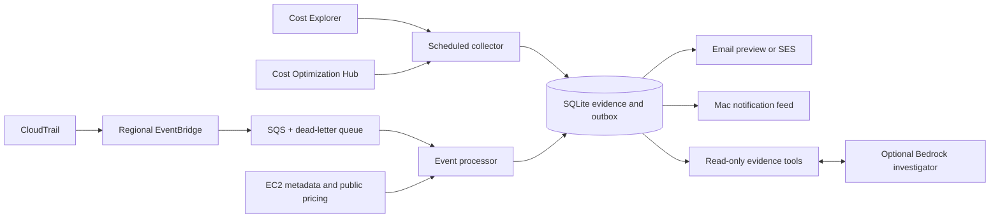

# Cloudwake operation reference

A standalone AWS cost investigator for a CTO: see where spending goes, investigate increases,
review savings opportunities, and receive email when resources are created. Python 3.11+.

This is a **single-account, single-worker MVP** with a CLI, durable SQLite state, SQS event
consumption and optional Bedrock tool use. It does not resize, stop, delete, or purchase resources.
No AWS account is needed for the demo. No cloud resources are deployed by installing or running it.

## macOS menu bar

A native menu bar companion shows spending, cost alerts, resource activity and savings, with
worker start/stop controls and an investigation window. It starts in demo mode.

```sh
bash macos/build.sh
open "dist/Cloudwake.app"
```

Requires macOS 13+ and Xcode Command Line Tools. See the [macOS app guide](../macos/README.md)
for account setup, background monitoring behavior and development checks.

## Try it locally

```sh
python3 -m venv .venv
source .venv/bin/activate
pip install -e '.[dev]'
aws-cost-agent demo
aws-cost-agent --demo ask "Where can we reduce spending?"
aws-cost-agent --demo ask "Who created new resources?"
aws-cost-agent --demo report --json
aws-cost-agent --demo outbox
pytest
```

For the exact dependency versions used during verification, install with
`pip install -r requirements.lock -e .`. Optional infrastructure validation:
`pip install -e '.[infra]'`, then
`cfn-lint infra/observer-role.json infra/events.json`.

The demo uses clearly labeled synthetic data, an isolated `data/demo.sqlite3` database, and
`data/demo-email-preview/*.eml` files. It makes no AWS, model, or email network calls.
You can also run it without installing dependencies:

```sh
PYTHONPATH=src python3 -m aws_cost_agent demo
```

## What works

| Capability | Source and behavior |
| --- | --- |
| Spending report | Cost Explorer `UnblendedCost` before credits/refunds, with credits, refunds and net balance shown separately; all regions in the connected account |
| Monthly forecast | AWS remaining-month forecast plus reported month-to-date spending; no fabricated forecast if unavailable |
| Spend increase detection | Day before yesterday versus median of three previous matching weekdays; both dollar and percentage thresholds |
| Savings recommendations | Paginated Cost Optimization Hub, one recommendation per resource; estimates and restart requirements preserved |
| Resource activity | Seven-day CloudTrail history backfill, then polling every five minutes in configured regions; create/update/delete management calls with actual AWS principals |
| Resource notifications | New creation calls from history polling, or optional CloudTrail → EventBridge → SQS for faster delivery; old backfill events never send notifications |
| Savings review priorities | Service-specific investigation leads ranked by your actual charges, clearly separated from measured AWS savings estimates |
| Idle-resource alerts | Fresh AWS Stop/Delete recommendations above a configurable estimated monthly saving; defaults to USD 25 with seven-day reminders |
| Mac notifications | Opt-in native banners for new resource events, spending alerts and idle-resource findings; deployment bursts are grouped |
| Cost of new EC2 | AWS public pricing for Linux/UNIX shared-tenancy On-Demand compute, assuming 730 hours; unsupported configurations stay unknown |
| Attribution | AWS event principal; EC2 owner/team tags when available. A deployment role is never labeled as a human |
| Email | Daily digest, spend threshold breaches, monthly forecast breach, idle-resource findings and resource creation notifications; preview by default, SES when configured |
| Investigation | Optional Bedrock Converse agent with three read-only evidence tools, a six-round limit, and no mutation or email tool |

The local `ask` fallback routes questions to saved evidence; it is **not an LLM**. Bedrock enables
natural-language investigation. Neither mode treats a coincident resource change as proof of a cost cause.

## Connect an AWS account

**From the Mac app:** open the gear icon, choose an existing AWS profile and resource region,
then click **Check account → Connect this account**. Cloudwake detects the account ID, checks
cost and recommendation access, and saves an isolated configuration automatically. Existing
event queues are discovered from the `aws-cost-agent-events` stack. No manual TOML editing
or queue URL copying is needed for this flow. Use **Sign in with SSO…** to renew an existing
IAM Identity Center session. Alternatively, choose **Paste credentials** and paste AWS export
lines, credential JSON, or a credentials-file section. You can also enter keys manually.
Temporary credentials require a session token. Credentials are verified with STS before being
saved in macOS Keychain, and are passed to the helper through stdin, never command arguments.
SSO and AWS CLI are optional for this flow. Expired temporary credentials need a fresh import.

If resource notifications are missing, **Set up resource notifications…** shows the account,
region and resources before **Install in AWS** creates the event stack. This requires an
active CloudTrail trail logging management writes and a profile with deployment permissions.
Existing stacks are reused, not updated. Missing AWS enrollment or permissions are shown with
console links. Checking account status makes read-only AWS calls, including a Cost Explorer
request that may be billable. Nothing is deployed just by checking or connecting.

The setup checks use CloudTrail read permissions, `compute-optimizer:GetEnrollmentStatus` and
`cloudformation:DescribeStacks` in addition to the runtime observation permissions. The observer
template includes these reads; stack deployment permissions are not granted by that template.
The wizard supports profiles that access the target account directly. Use **Advanced settings &
demo** for an existing custom config, cross-account observer role, multiple monitored regions,
email settings, file paths or demo mode. Manual setup remains available below.

1. Enable Cost Explorer in the customer account. Enable Cost Optimization Hub and opt in to
   Compute Optimizer to obtain its recommendations. The agent reports unavailable coverage
   if recommendations or forecasts are inaccessible.
2. Copy `config.example.toml` to `config.toml`; set the expected AWS account ID and region.
3. Use an existing AWS SSO/profile or workload role through the normal boto3 credential chain.
   For cross-account access, deploy `infra/observer-role.json` in the customer account using
   the exact operator IAM role ARN and a unique external ID. Put its RoleArn and external ID
   in the configuration. Temporary credentials are refreshed before expiration.
4. Give the operator role permission to assume that exact customer role. The optional
   SES and Bedrock permissions in `infra/operator-policy.example.json` are examples: replace
   the account, identity, recipient and model placeholders. Inference profiles may require
   profile and destination-model permissions; follow the selected model's AWS documentation.
5. For same-account operation without `role_arn`, grant the observer role's observation
   permissions to your existing workload role instead. No static access keys are needed in config.

```sh
aws-cost-agent --config config.toml sync
aws-cost-agent --config config.toml report
aws-cost-agent --config config.toml digest
aws-cost-agent --config config.toml deliver
```

Cost Explorer API requests and supporting AWS services can incur charges. Collection defaults
to every six hours, rather than querying on every chat question. Reports show collection time,
billing coverage, currency and provisional status. The account filter intentionally excludes
other linked accounts even when credentials belong to an Organizations management account.
Use a separate database/config/worker for each account in this version.

The menu's main amount is **spend before credits and refunds**. For example, USD 120 in
charges offset by USD 120 in credits shows **USD 120 spend**, **USD −120 credits**, and
**USD 0 net**. It is not a list-price or undiscounted estimate: other AWS charge types,
including applicable discounts, fees and taxes, remain in the UnblendedCost calculation.
Service breakdowns, daily charts, spending alerts and forecasts use the same before-credit
basis. The net balance remains separately available as `analysis.month_to_date`; the main
amount is `analysis.spend_before_credits`. Each collection paginates two cost queries so
credits/refunds can be separated without losing service/region detail.

The reporting period is the first of the current UTC month through yesterday. AWS billing
data is delayed and provisional; the app cannot show an instantaneous or final invoice total.

## Monitor teammate-created resources

**No deployment is needed for the Changes tab.** Start monitoring or click **Changes → Check
now** to import recent CloudTrail history. Grant `cloudtrail:LookupEvents` to your connected
role. By default this reads `[aws].region`; set `history_regions = ["us-east-1", "us-west-2"]`
inside `[aws]` for additional regions (up to ten). AWS history covers management events,
not every data-plane action. The initial backfill covers seven days and imports at most 500
events per region per check; a saved page token continues busy-account imports on later checks.
The screen reports pending backfill and permission failures. Only new creation calls after
history enrollment generate notifications; updates/deletions are shown as activity.
Polling overlaps the prior window by 15 minutes for delayed events and deduplicates event IDs.
Events arriving later than that overlap may be missed; this is not a guaranteed audit feed.

For faster event delivery, optionally use EventBridge and SQS:

Enable or reuse an **active CloudTrail trail with write management events** covering each
monitored region. Event history alone is insufficient for the EventBridge integration.
`infra/events.json` deliberately reuses that trail; it does not create a duplicate trail.

Deploy the regional template in each region you want to monitor. These are manual deployment
commands; review the templates first. The agent itself has no CloudFormation deployment permissions.

```sh
aws cloudformation deploy --template-file infra/observer-role.json \
  --stack-name aws-cost-agent-observer --capabilities CAPABILITY_NAMED_IAM \
  --parameter-overrides OperatorRoleArn=arn:aws:iam::111122223333:role/CostAgentWorker ExternalId=REPLACE_WITH_UNIQUE_CUSTOMER_ID

aws cloudformation deploy --template-file infra/events.json \
  --stack-name aws-cost-agent-events --region us-east-1

aws cloudformation describe-stacks --stack-name aws-cost-agent-events \
  --region us-east-1 --query 'Stacks[0].Outputs'
```

Paste each QueueUrl under `[aws.queues]`, keyed by region. Run:

```sh
aws-cost-agent --config config.toml run --once
aws-cost-agent --config config.toml run
```

The worker persists each event and its notification in one SQLite transaction before deleting
the queue message. Duplicate CloudTrail IDs are ignored. Failed processing is retried by SQS
and moves to a dead-letter queue after five receives. The template also sets an EventBridge
delivery DLQ and a CloudWatch DLQ alarm. Supply an existing `AlarmTopicArn` to route that alarm;
without it the alarm is visible in CloudWatch but sends no external notification.

CloudTrail delivery is not instantaneous or guaranteed for every event. Coverage includes
management `Create*` calls and the explicit provisioning APIs in `src/aws_cost_agent/events.py`.
It depends on CloudTrail coverage and the regions whose queues are configured. Redeploy existing
`infra/events.json` stacks to apply the expanded event pattern. This is not a guarantee of every
AWS resource creation; the agent does not yet reconcile inventory for missed events, monitor
all configuration changes, or follow a CI/CD principal back to a Git commit or teammate.
RDS/Lambda/EBS/NAT creation notifications currently report unknown cost and owner. EC2 pricing
excludes disks, networking, taxes, CPU credits, discounts, and commitments.

## Idle-resource monitoring

In **Savings**, click **Enable AWS savings…** to opt the connected account into standard
Compute Optimizer and Cost Optimization Hub recommendations. Each account must enroll
separately with a role permitted to call the services' `UpdateEnrollmentStatus` actions and
create their service-linked roles. The observer template intentionally does not grant those
enrollment writes. The app never opts in other organization members, paid enhanced metrics,
or automatic remediation. Newly enrolled accounts need time for AWS to analyze utilization.

Until AWS provides estimates, the tab still shows **Review priorities** derived from actual
service charges. These are investigation leads with savings explicitly unmeasured; they are
not idle-resource findings and do not generate idle-resource notifications.

The collector checks AWS Cost Optimization Hub recommendations for **Stop** or **Delete** actions
with evidence refreshed within 72 hours. It does not infer inactivity just from a resource's age.
By default it alerts when an eligible resource has at least **USD 25/month** in estimated savings,
then reminds you after **seven days** if a fresh finding still qualifies. Savings are estimates,
not exact billed charges. Confirm ownership, dependencies, backups and disaster-recovery needs
before acting; the agent makes no infrastructure changes.

Adjust the existing `[agent]` section in your configuration:

```toml
idle_alerts = true
idle_monthly_savings = 25
idle_reminder_days = 7
unused_after_days = 7
```

Coverage depends on AWS-supported resources, enrollment and utilization analysis. Missing or
stale recommendations do not produce idle alerts. Collection runs every six hours by default;
these findings and spending alerts follow AWS data availability, rather than live billing.

Cloudwake also tracks **repeated unused observations** and alerts after `unused_after_days`
(default **7 days**), even below the USD 25 immediate savings threshold. This covers unattached
EBS volumes in `aws.history_regions` (or `aws.region` when omitted), plus fresh Stop/Delete
recommendations from Cost Optimization Hub. The **Savings → Unused resources** section shows
progress toward the alert and any missing permissions. EBS checks require `ec2:DescribeVolumes`,
now included in the observer template; existing deployed observer roles need that read permission.

Each duration alert includes the resource, region, observed period and creator's AWS identity
when a matching creation event exists in the local CloudTrail history. Creator matching currently
covers EBS volumes, EC2 instances, Lambda functions and RDS instances/clusters with unambiguous
creation IDs; other resources show creator unavailable. A deployment role is shown as the role,
not attributed to an invented person. Events older than the initial seven-day history backfill
may lack creator information, and some service-created resources have no separate creation call.

Tracking starts with the first successful check, **not the resource's creation date**. An absent
finding, a recorded EBS attachment, or a gap over twice the configured sync interval plus one hour
resets its observation period. These are sampled findings, not proof of continuous inactivity.
Keep the local worker running on an awake Mac, or enable always-on AWS monitoring, to build the observation history. Duration alerts use
the existing Mac notification permission and email delivery settings; `idle_alerts = false`
disables both types of idle notification. EBS savings remain unmeasured unless AWS provides an
estimate; the agent does not delete or stop resources.

## Team spending and always-on monitoring

Overview can group the same monthly bill by service, `Project`, or `Owner`, including an explicit
Unassigned category. Cloudwake can also run its collector in AWS while the Mac is asleep, with
a shared private inbox and saved monitoring history. See the [setup and operation guide](always-on.md).
This deployment keeps email disabled.

## Email and chat

Cloudwake's **Inbox** keeps notification evidence available after banners disappear. Alerts can
be read, marked reviewed, reopened, or snoozed for one hour, one day or one week. State is saved
per local connection. Snoozed alerts return to Open as unread; inbox actions leave email and Mac
notification delivery unchanged. See the [macOS inbox guide](../macos/README.md#alert-inbox).

The CLI provides the same workflow. Local connections read SQLite; cloud connections read private S3 state and invoke Lambda for inbox updates:

```sh
aws-cost-agent --config config.toml inbox list --filter open
# Use sequence and feed_id from the list response to update that inbox entry.
aws-cost-agent --config config.toml inbox update --sequence 12 --feed-id YOUR_FEED_ID --action review
aws-cost-agent --config config.toml inbox update --sequence 12 --feed-id YOUR_FEED_ID --action snooze --hours 24
```

Keep `notifications.delivery = "preview"` to write local `.eml` files. To send email, set
`delivery = "ses"`, a verified sender, and recipients. SES must be configured in `[aws].region`;
in the SES sandbox, recipients also need verification. The operator identity sends the email.

`sync` queues anomalies and idle-resource alerts; `digest` queues the daily report; `deliver` processes pending mail.
The long-running worker handles all three automatically, sending the daily digest after
`digest_hour_utc` when today's snapshot is available. Set a positive `monthly_budget` in USD
to enable the once-per-month forecast alert. Creation alerts can be disabled independently.

Messages already previewed are **not** sent retroactively when you switch to SES. Failed
deliveries remain pending for retry; inspect `outbox` and worker logs. SES delivery is at least
once: a crash after AWS accepts the email but before SQLite records success can cause a duplicate.
Run only one worker for a database. No emails are sent as part of automated tests.

For natural-language investigation, set `[ai].bedrock_model_id` to a model or inference profile
available in your region that supports Converse tool use. The agent sends the selected local
cost, resource and ownership evidence to that Bedrock model; it does not send AWS credentials.

```sh
aws-cost-agent --config config.toml ask "Why did compute spending increase, and what should we review?"
```

## Architecture



SQLite and the local outbox contain account identifiers and cost information. Store `data/`
on a protected, persistent disk. There is no web server or multi-tenant authentication layer.
For a container, build the Dockerfile, mount a persistent volume at `/app/data`, mount config at
`/app/config.toml`, and supply a workload role. No credentials belong in the image.

Current limitations: savings are recommendations, not verified realized savings; no automatic
remediation; no web dashboard; no organizational rollup; no human identity correlation;
no budget currency conversion; missing billing dates are unknown, not assumed zero. Initial
anomaly detection requires three corresponding historical weekdays. AWS Cost Explorer data
is delayed and revisable, and an `Estimated` flag is preserved in the report.

## AWS references

- [Cost Explorer GetCostAndUsage](https://docs.aws.amazon.com/aws-cost-management/latest/APIReference/API_GetCostAndUsage.html)
- [Cost Explorer forecasts](https://docs.aws.amazon.com/aws-cost-management/latest/APIReference/API_GetCostForecast.html)
- [Cost Optimization Hub enrollment](https://docs.aws.amazon.com/cost-management/latest/userguide/coh-getting-started.html)
- [Cross-account external IDs](https://docs.aws.amazon.com/IAM/latest/UserGuide/id_roles_common-scenarios_third-party.html)
- [CloudTrail events in EventBridge](https://docs.aws.amazon.com/eventbridge/latest/userguide/eb-service-event-cloudtrail.html)
- [EBS volume lifecycle and ongoing storage costs](https://docs.aws.amazon.com/ebs/latest/userguide/ebs-volume-lifecycle.html)
- [CloudTrail creator identities and assumed roles](https://docs.aws.amazon.com/awscloudtrail/latest/userguide/cloudtrail-event-reference-user-identity.html)
- [EventBridge queue permissions](https://docs.aws.amazon.com/eventbridge/latest/userguide/eb-use-resource-based.html)
- [SES SendEmail](https://docs.aws.amazon.com/ses/latest/APIReference-V2/API_SendEmail.html)
- [Bedrock Converse tool use](https://docs.aws.amazon.com/bedrock/latest/userguide/tool-use.html)
